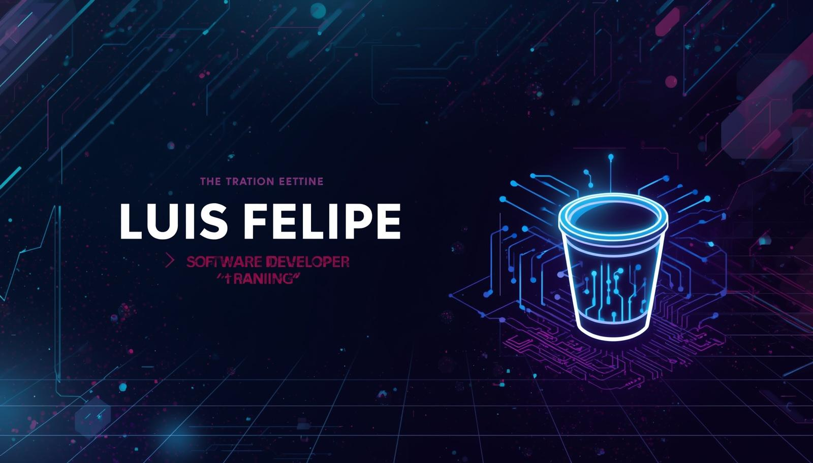

  

# 👋 Olá, eu sou Luis Felipe Ferreira

## Sobre mim

Tenho 31 anos e sou natural do Rio Grande do Sul. Minha paixão por tecnologia me motiva a buscar constantemente evolução na área de desenvolvimento de software.

- 🎓 **Formação acadêmica**: Ensino médio completo (Colégio Ensinos NH)
- 📚 **Formação técnica**: Desenvolvimento de Software Bilíngue (em andamento)
- 🚀 **Especialização atual**: Cursos intensivos com Rodolfo Mori no **DevClub**
- 💡 **Objetivo**: Consolidar minha carreira como desenvolvedor e contribuir com soluções inovadoras

## 💻 Foco atual

Aprimorando meus conhecimentos em desenvolvimento de software através do DevClub, buscando me tornar um profissional cada vez mais completo e preparado para os desafios do mercado.

## 🚀 Tecnologias que uso

  
  
  
  
  
  
  

 

## 📊 Estatísticas e Atividade

  
  
   
  
  
  
   
  
  

 

---

  <i>⭐ Se você gosta do meu trabalho, considere me seguir! ⭐</i>

